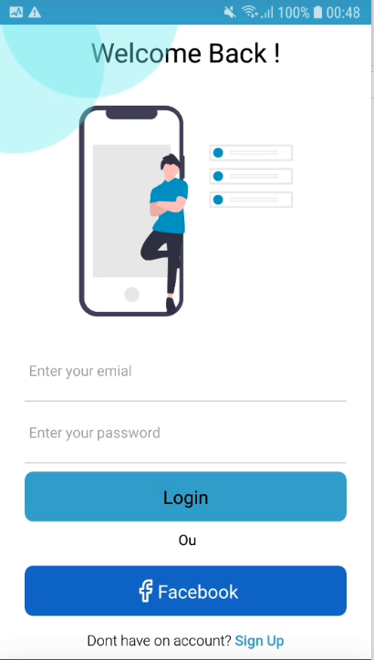
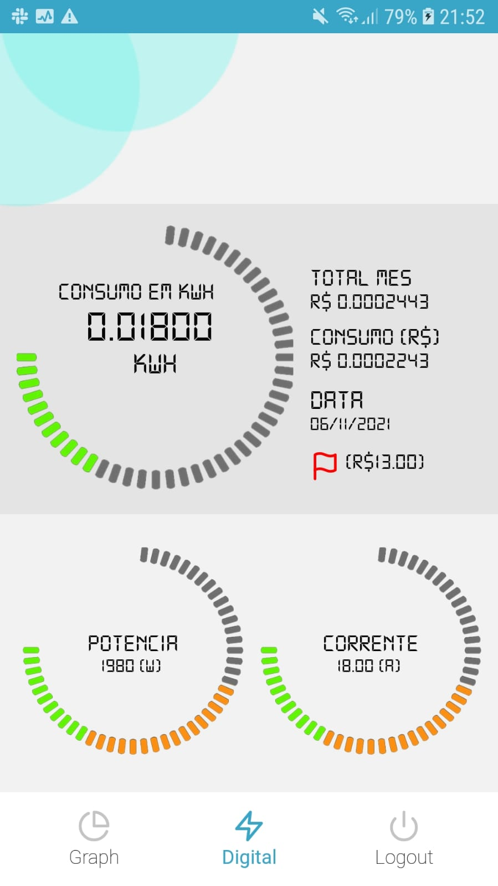
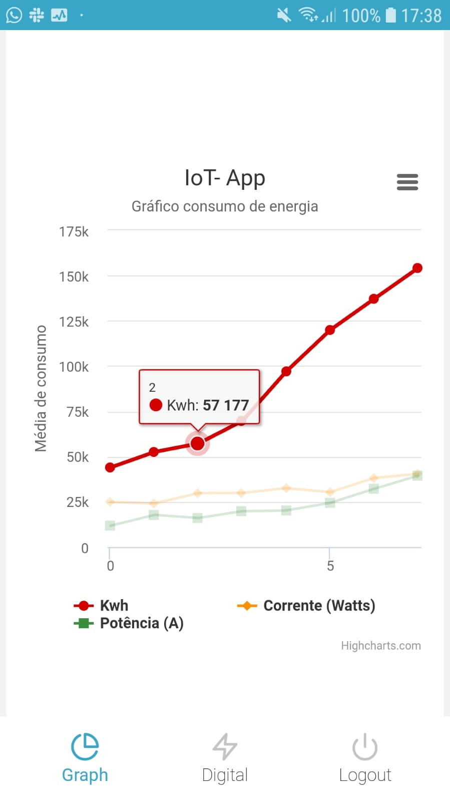

# Projeto em React

Aplicativo usando React Native integrado a API do Firebase, com a intenção de apresentar ao usuário os dados reais do consumo de energia.

## Screenshots

  
  
    
    

# Instalar dependências e startar emulador 

Para inicializar projeto  necessário executas o comando a baixo

- [Instalar dependências](https://classic.yarnpkg.com/lang/en/docs/install/#windows-stable) yarn install
- [Rodar emulador Android/IOS](https://yarnpkg.com/package/android-versions) yarn android ou yarn ios

## create SH1
gradlew signingReport

## Instalar ou atualizar pacotes

yarn install

## Run App

yarn android or android ios

## Usuarios de teste Facebook

Para logar com uma conta no Facebook, é necessesario de uma conta de usuário de teste.
- Usuário teste: fretasnetoednei@gmail.com, senha: Nos@@250681

## Confiuguração do projeto

Criar um arquivo .env na raiz do projeto e adicionar as variveis.

IP=SEU_IP
WEB_CLIENT_ID=SEU_WEB_CLIENT_ID
