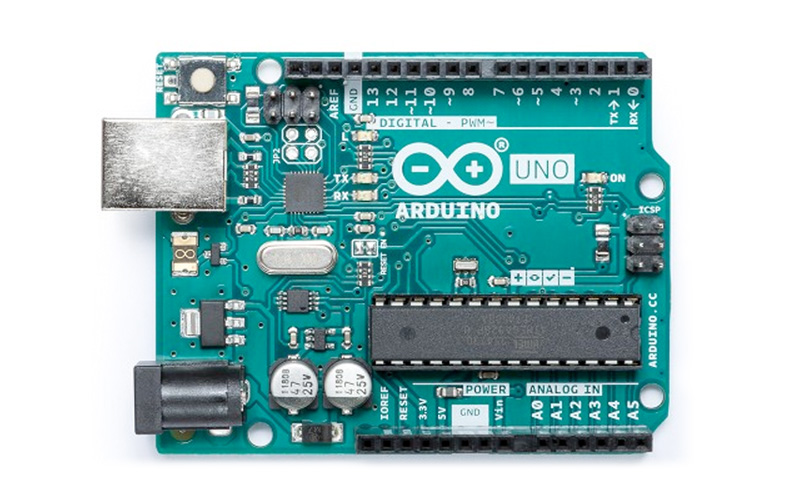

# Calculo de Energia - Arduino & React Native

Este projeto consiste em calcular o consumo de energia utilizando um micro controlador (Arduino), onde recebe a corrente é enviada por um sensor. O Arduino ao receber a corrente envia os dados para o back-end e por fim o back-end envia os dados para a nuvem atualizando a aplicativo. Assim o usuário pode ter acesso as informações em tempo real.

# Arduino

## Projetos

- [Project App](https://github.com/EdneiFNeto/AutomacaoResidencial/tree/main/App-React) Projeto usando React Native, com a intenção de apresentar ao usuário os dados reais do consumo de energia.

- [Back - End](https://github.com/EdneiFNeto/AutomacaoResidencial/tree/main/back-end) Back-End utilizando NodeJS integrado ao Firebase, com a intenção de enviar os dados recebidos do Arduino e enviar para nuvem.

## Bibliotecas

- [Material-icons](https://material.io/)
- [axios](https://github.com/axios/axios)
- [react-Native](https://pt-br.reactjs.org/)

## Templete
Templete utilizado como exemplo para desenvolvimento da aplicação [Figma Mobile](https://www.figma.com/file/EbEZHtYOIdmFlMKYFsRTXo/Figma-Mobile-Desingn?node-id=0%3A1).

## Atuores
- Ednei de Freitas Neto
- Nicolly Guimaraes
 
