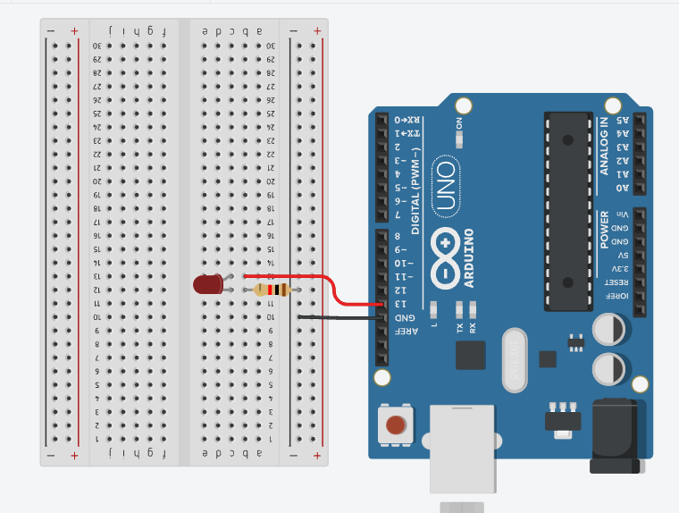

## Serial Port
O objetivo deste  é ler a porta serial e assim poder ligar/desligar um led utiliando API nodeJS 

## Screenshots


## Bibliotecas utilizadas

- [Express](https://expressjs.com/pt-br/) 
- [Serial Port](https://serialport.io/docs/guide-usage/)

## Código fonte do Arduino

```c

#include "EmonLib.h";
int voltage = 127;
int pinSCT = A1;
EnergyMonitor SCT013;
int potency;
char json;
double Irms;

void setup() {
  Serial.begin(9600);
  SCT013.current(pinSCT, 60.607);
}

void loop() {

  Irms = SCT013.calcIrms(1480);  
  potency = Irms * voltage; 

  Serial.print("{irms:");
  Serial.print((String)+Irms+", ");

  Serial.print("potency:");
  Serial.print((String)+potency+", ");

  
  Serial.print("voltage:");
  Serial.print((String)+voltage);
  
  Serial.println("}");

  
  delay(3000);  
}
```
 
 ## Código fonte do Node JS
```javascript
import express from 'express';
import  http from 'http';
import { getDatabase, ref, push } from "firebase/database";
import { initializeApp } from "firebase/app";
import { format } from 'date-fns'

const firebaseConfig = {
  ...
};

initializeApp(firebaseConfig);

const app = express();
app.use(express.json());

const server = http.createServer(app);
import SerialPort from 'serialport';
const ReadLine = SerialPort.parsers.Readline;

const mySerial = new SerialPort("COM25", { 
  baudRate: 9600,
});

let myValue;
const parser = new ReadLine({ delimiter: '\r\n' });
mySerial.pipe(parser);

mySerial.on("open", () => {
  parser.on('data', (data) => {
    if(myValue !== undefined){
      const  valueLowecase = String(myValue).toUpperCase();

      if(valueLowecase === 'OFF'){
        mySerial.write('1') 
      } else if(valueLowecase === 'ON'){
        mySerial.write('2') 
      }
    }
    sendConsumo(data);
  });
});

app.post('/low', (request, response, next ) => {
  const { command } = request.body;
  const  valueLowecase = String(command).toUpperCase();
  
  if(valueLowecase !== 'OFF' && valueLowecase !== 'ON')
    return response.status(404).json({ status: `Command not found` });
  
  myValue = command;
  return response.status(200).json({ status: valueLowecase === 'OFF' ? 'OFF': 'ON' });
});

async function sendConsumo(data) {
  const db = getDatabase();
  push(ref(db, '/consumption_kwth'), 
    { data, date_time: format(new Date(), 'yyyy-MM-dd HH:mm:ss') })
    .then(()=> console.log('Send success', data))
    .catch(error => console.error('error', error));
}

server.listen(3000, () => {
  console.log(`Server run in `);
});
```

## Configuração .Env
Adicionar as linhas a baixo para segurança do projeto

IP=IP
AUTHORIZATION_TOKEN=AUTH_TOKEN
PROJECT_ID=PROJECT_ID