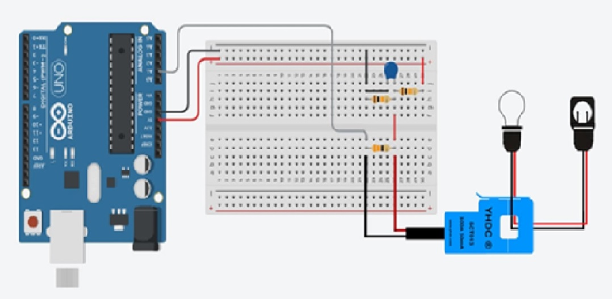

## Serial Port
O objetivo deste  é ler a porta serial e assim poder ligar/desligar um led utiliando API nodeJS 

## Screenshots


## Bibliotecas utilizadas

- [Express](https://expressjs.com/pt-br/) 
- [Serial Port](https://serialport.io/docs/guide-usage/)

## Código fonte do Arduino

```c

#include "EmonLib.h";
int voltage = 127;
int pinSCT = A1;
EnergyMonitor SCT013;
int potency;
char json;
double Irms;

void setup() {
  Serial.begin(9600);
  SCT013.current(pinSCT, 60.607);
}

void loop() {

  Irms = SCT013.calcIrms(1480);  
  potency = Irms * voltage; 

  Serial.print("{ \"irms\": ");
  Serial.print((String)+Irms+", ");

  Serial.print("\"potency\": ");
  Serial.print((String)+potency+", ");

  
  Serial.print("\"voltage\": ");
  Serial.print((String)+voltage);
  
  Serial.println(" }");
 
  delay(3000);
  
}
```
## Iniciar back end
Para rodar o back-end, primeiro precisa seguir um passo a passo:
  - yarn install (instalar libs)
  - npx nodemon app.js (Rodar servidor)
  - Iniciar o Arduino enviando sua PORTA USB em que o Arduino está conectada para endpoint (http://IP:3000/running).
  - Este método é do tipo POST -   { "port": "Sua Porta USB" }
  
## Configuração .Env
Adicionar as linhas a baixo para segurança do projeto, como IP de sua maquina e dados do firebase.

- IP=IP
- AUTHORIZATION_TOKEN=AUTH_TOKEN
- PROJECT_ID=PROJECT_ID


